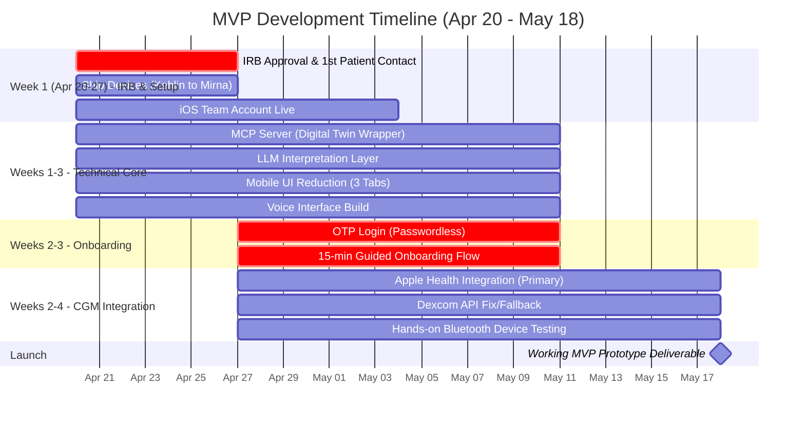

# Calm Glucose Guide (Google Health)

## 📌 Next Steps & Technical Priorities

As part of the push towards the **May 18 MVP** and the start of clinical patient testing, our immediate technical priorities are to resolve current blockers and clean the interface for our senior and T2D demographic on insulin.

### Immediate Focus (The "First Issues")
1. **Reduce Mobile Interface:** Simplify the current UI layout by keeping only three core tabs (`Journey`, `Circle`, `Learn`). We need to hide/remove the extra tabs to prevent overwhelming senior users during testing.
2. **Dexcom Connection Fix:** The `dexcom-auth` function is currently failing. We will pivot to using **Apple Health** as our primary integration path to unblock the MVP, while keeping the Dexcom API setup as a fallback.
3. **Digital Twin Server Connection:** The Digital Twin server endpoint isn't connecting organically. To stabilize this and match the timeline, we will construct the local MCP server wrapper and LLM interpretation layer to handle the twin proxy.

## 📅 Roadmap & Timeline (April 20 - May 18)

Here is the updated timeline for the MVP sprint leading to the May 18 prototype delivery.



---

## Project info

**URL**: https://lovable.dev/projects/REPLACE_WITH_PROJECT_ID

## How can I edit this code?

There are several ways of editing your application.

**Use Lovable**

Simply visit the [Lovable Project](https://lovable.dev/projects/REPLACE_WITH_PROJECT_ID) and start prompting.

Changes made via Lovable will be committed automatically to this repo.

**Use your preferred IDE**

If you want to work locally using your own IDE, you can clone this repo and push changes. Pushed changes will also be reflected in Lovable.

The only requirement is having Node.js & npm installed - [install with nvm](https://github.com/nvm-sh/nvm#installing-and-updating)

Follow these steps:

```sh
# Step 1: Clone the repository using the project's Git URL.
git clone <YOUR_GIT_URL>

# Step 2: Navigate to the project directory.
cd <YOUR_PROJECT_NAME>

# Step 3: Install the necessary dependencies.
npm i

# Step 4: Start the development server with auto-reloading and an instant preview.
npm run dev
```

**Edit a file directly in GitHub**

- Navigate to the desired file(s).
- Click the "Edit" button (pencil icon) at the top right of the file view.
- Make your changes and commit the changes.

**Use GitHub Codespaces**

- Navigate to the main page of your repository.
- Click on the "Code" button (green button) near the top right.
- Select the "Codespaces" tab.
- Click on "New codespace" to launch a new Codespace environment.
- Edit files directly within the Codespace and commit and push your changes once you're done.

## What technologies are used for this project?

This project is built with:

- Vite
- TypeScript
- React
- shadcn-ui
- Tailwind CSS

## How can I deploy this project?

Simply open [Lovable](https://lovable.dev/projects/REPLACE_WITH_PROJECT_ID) and click on Share -> Publish.

## Can I connect a custom domain to my Lovable project?

Yes, you can!

To connect a domain, navigate to Project > Settings > Domains and click Connect Domain.

Read more here: [Setting up a custom domain](https://docs.lovable.dev/features/custom-domain#custom-domain)
